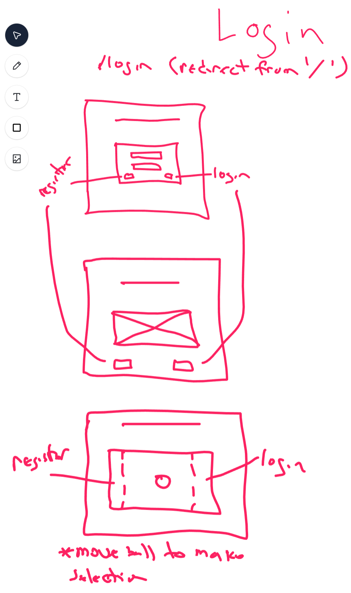
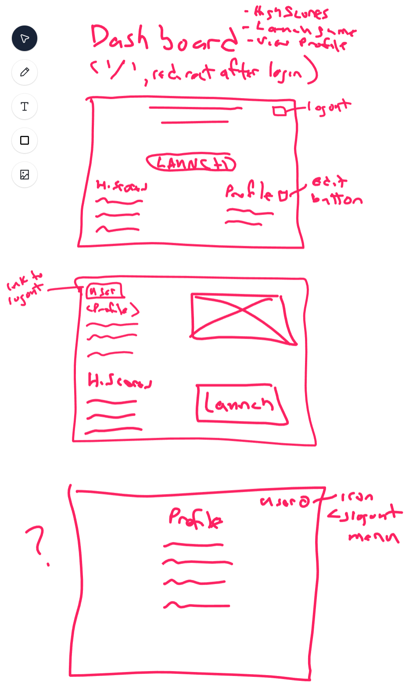
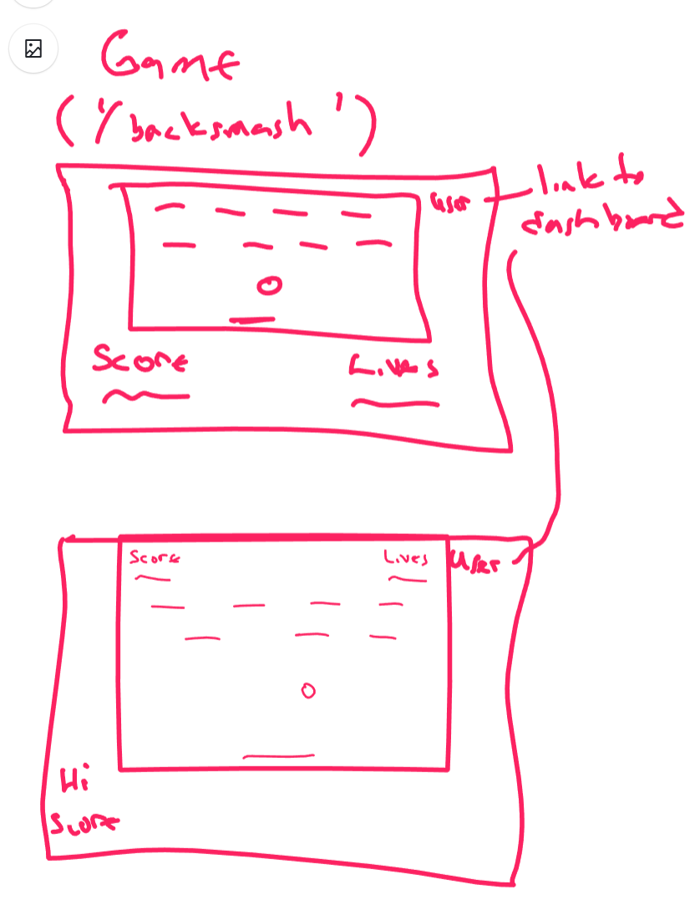

# Project Planning
For this assignment, you'll create some initial plans for your project.

## Assignment Description
[Project Planning Assignment](https://education.launchcode.org/liftoff/modules/assignments/project-planning)

## Submission Instructions

### Wireframes

 * [inVision Wireframe](https://kris272354.invisionapp.com/freehand/BrickSmash-Wireframe-sSBkRTw5V?v=caaDkg2dAZwyh%2B2Swh72%2BA%3D%3D&linkshare=urlcopied)
 
 *  

 * 
 
 * 

### Project Tracker

https://trello.com/b/E6anX8cg/liftoff-project

### Project Repo Link

https://github.com/KrazyK786/BrickSmash
